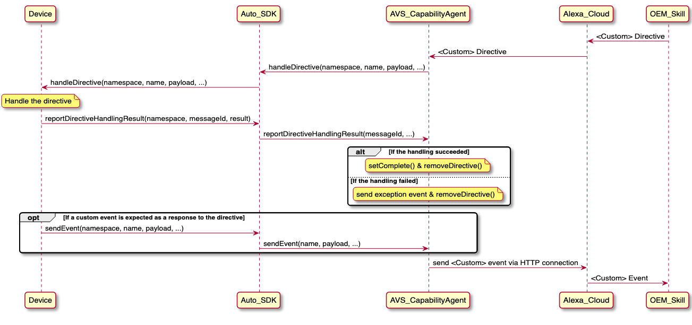
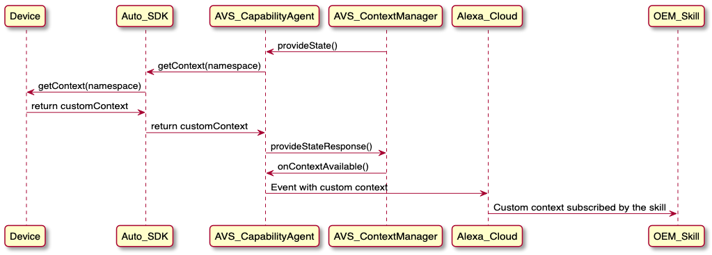

# Custom Domain Module

## Overview

The Alexa Auto SDK `Custom Domain` module creates a bi-directional communication channel between your device and your cloud custom skills, allowing you to build customized experience with your in-vehicle Alexa Custom Assistant. By using this module, you can instruct Auto SDK to send data (in Events and Contexts) from your device to your cloud custom skills that can consume the data, and also receive the data (in Directives) dispatched by the skills to the device. 

`Custom Domain` provides an AASB message interface that you can integrate with to enable the bi-directional communication between your device and your custom skills in the cloud. Since Auto SDK is built on top of Alexa Voice Service (AVS) Device SDK which utilizes directives and events to achieve the communication with Alexa Cloud, this module enables your device to receive custom directives from your skills and send custom events, contexts to your skills that can process them. 

## Prerequisites
To use Custom Domain module, please contact your Solution Architect to onboard your device type, vendor ID, custom skill IDs, custom interface names, etc.

## Auto SDK Custom Domain Sequence Diagrams 
This diagram illustrates the sequence of receiving custom directives and sending custom events.



This diagram illustrates the sequence of providing custom states in the context when required. The event that requires context could be from the device, Auto SDK, or AVS itself and it could be custom or non-custom ones. For any AVS event, as long as it requires context, which is queried by the `ContextManager`, the Auto SDK Engine publishes `GetContext` message, and the registered custom states should be provided by replying the message. 



## Required Engine Configuration
The Custom Domain module requires proper Engine Configuration for your custom interfaces. Below is the expected configuration format. 

**Sample JSON Object**
```
"aace.customDomain" : {
    "interfaces": [
        {
            "namespace": "{{String}}",
            "version": "{{String}}"
            "states": ["{{String}}", "{{String}}", ...]         
        },
        {
            "namespace": "{{String}}",
            "version": "{{String}}",
            "states": ["{{String}}", "{{String}}", ...]         
        },
        ...
    ]
}
```
**Object Parameters**

| Field | Type | Required | Description |
|-|-|-|-|
| aace.customDomain.<br>interfaces | list | Yes | The list of custom interfaces for the communication between your device and skills. |
| aace.customDomain.<br>interfaces[i].namespace | string | Yes | The namespace of the custom interface. The string must follow the convention `Custom.<vendorId>.<customInterfaceName>`, where the `vendorId` must match your actual vendorId that should be onboarded and allow-listed, and the `customInterfaceName` is a string of your own choice based on the responsibility of the interface. The namespace must match with the one you specified in your Skill Manifest.|
| aace.customDomain.<br>interfaces[i].version | string | Yes | The version of the custom interface in string. The version should follow the versioning convention `<major>.<minor>`. e.g. "1.0". |
| aace.customDomain.<br>interfaces[i].states | list | No | Optional. The list of the custom state names for a custom interface. It must be provided if custom states are available for this interface. The custom state names must match with the ones you specified in your Skill Manifest.|

**Note:** On AACS and AACS Sample App, this module is disabled by default. Please refer to [AACS Configuration documentation](https://alexa.github.io/alexa-auto-sdk/docs/android/aacs/service/) to enable the module through AACS configuration file. If your product does not use AACS but uses AASB messages and if you do not intend to enable the communication between the vehicle and your cloud Alexa skills, you can disable this module by providing the block below in the Engine Configuration.
```jsonc
    "aasb.customDomain": {
        "CustomDomain": {    
            "enabled": false
        }
    }
```

## Using the Custom Domain Module AASB Messages

### Receiving and handling a custom directive
Custom directives carry the information from your custom skills to the device. When a new directive arrives, the Engine publishes [`HandleDirective` message](https://alexa.github.io/alexa-auto-sdk/docs/aasb/custom-domain/CustomDomain/index.html#handledirective) with directive metadata including namespace, name, payload, etc. Only directives with custom namespaces configured in the Engine Configuration will be received.

### Reporting a directive handling result
After handling a directive, your application is responsible for reporting the directive handling result by publishing [`ReportDirectiveHandlingResult` message](https://alexa.github.io/alexa-auto-sdk/docs/aasb/custom-domain/CustomDomain/index.html#reportdirectivehandlingresult) with the necessary directive metadata.

### When a directive is cancelled
It is possible that the arrived directive is cancelled by AVS due to associated directives (e.g. a Speak directive) is not handled properly or an error occurs. In this case, the Engine publishes [`CancelDirective` message](https://alexa.github.io/alexa-auto-sdk/docs/aasb/custom-domain/CustomDomain/index.html#canceldirective) to inform your application that a directive is cancelled. Depending on the use case, your application might need to process the cancellation accordingly and inform the user that a previous directive is cancelled. 

### Sending a custom event
Custom events carry the information from your application to your skills. Your application can inform the Engine to send a custom event to the Alexa cloud by publishing [`SendEvent` message](https://alexa.github.io/alexa-auto-sdk/docs/aasb/custom-domain/CustomDomain/index.html#sendevent) with required event metadata. Only custom events with configured custom namespaces in the Engine Configuration will be sent to the Alexa cloud, and only events with custom namespaces registered and onboarded with the cloud services can be received by your skill. If the custom event should be sent with context, set `requiresContext` to true in the AASB message payload. Optionally, you can also include the custom context (if available) for the custom event's namespace in the `SendEvent` message, and it's recommended to do so to avoid the unnecessary `GetContext` messages from the Engine. If the custom event is in response to a custom directive, make sure the `correlationToken` for the event matches with the one the directive has. Your application can also send proactive events, which can trigger a skill session without user interaction. `correlationToken` is not required for proactive events. 

### Providing custom states in Context
Context communicates the state of the device client components to AVS. A context object reflects the state of client components immediately before its associated event is sent. Please refer to [AVS documentation](https://developer.amazon.com/en-US/docs/alexa/alexa-voice-service/context.html) for more information on Context. The Engine publishes [`GetContext` message](https://alexa.github.io/alexa-auto-sdk/docs/aasb/custom-domain/CustomDomain/index.html#getcontext) to query the custom context with a specific configured custom namespace. Your device is expected to reply back the custom context quickly, and should provide the custom context in a String representation of a JSON object in [`GetContextReply` message](https://alexa.github.io/alexa-auto-sdk/docs/aasb/custom-domain/CustomDomain/index.html#getcontextreply). Below is the expected JSON structure for the custom context, which needs to be serialized to a single String to be included in the `GetContext` message reply. The context states should match the ones specified in the Custom Domain Engine Configuration. 

```
{
    "context": [                                               
        {
            "name": "{{String}}",
            "value": {{Object}} | "{{String}}" | {{Long}},
            "timeOfSample": "{{String}}",                                
            "uncertaintyInMilliseconds": {{Long}}                   
        },
        {
            "name": "{{String}}",
            "value": {{Object}} | "{{String}}" | {{Long}},
            "timeOfSample": "{{String}}",                                
            "uncertaintyInMilliseconds": {{Long}}                    
        },
        ...
    ]
}
```
**Object Parameters**

| Field | Type | Required | Description |
|-|-|-|-|
|context | list | Yes | List of custom states to be reported.|
|context[i].name | string | Yes | The name of the custom context property state.|
|context[i].value | string/object/number | Yes| The value of the context property state. |
|context[i].timeOfSample | string | No | The time at which the property value was recorded in ISO-8601 representation. If omitted, the default value is the current time recorded when AVS constructs the context. |
|context[i].uncertaintyInMilliseconds | integer | No | The number of milliseconds that have elapsed since the property value was last confirmed. If omitted, the default value is 0. |